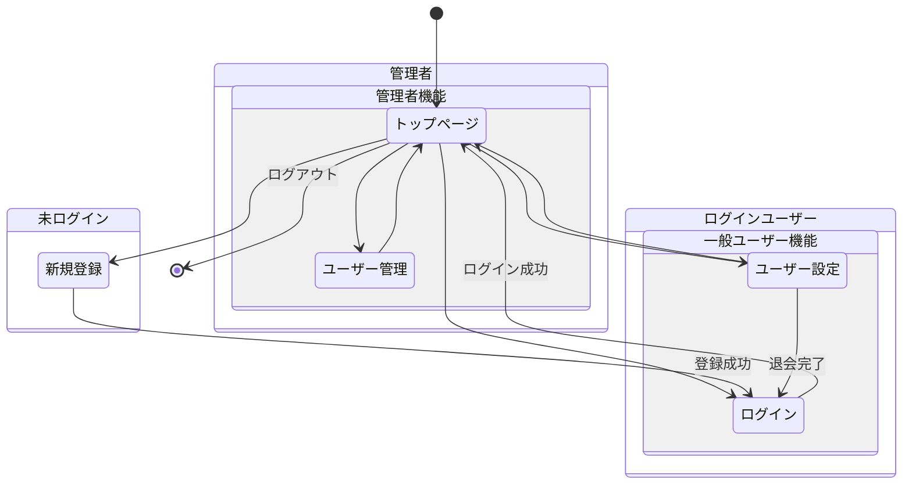
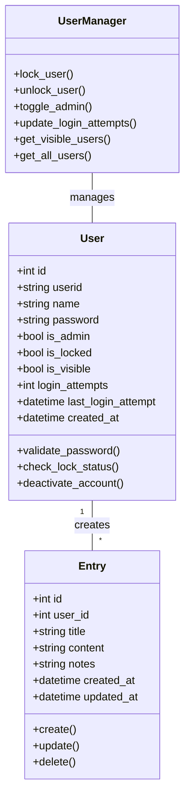
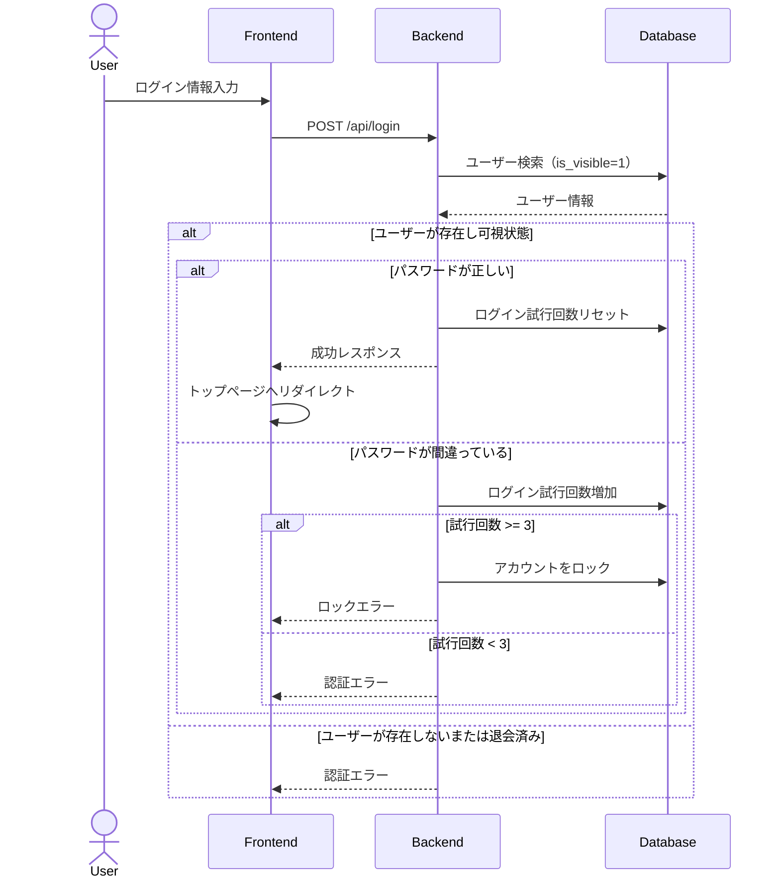
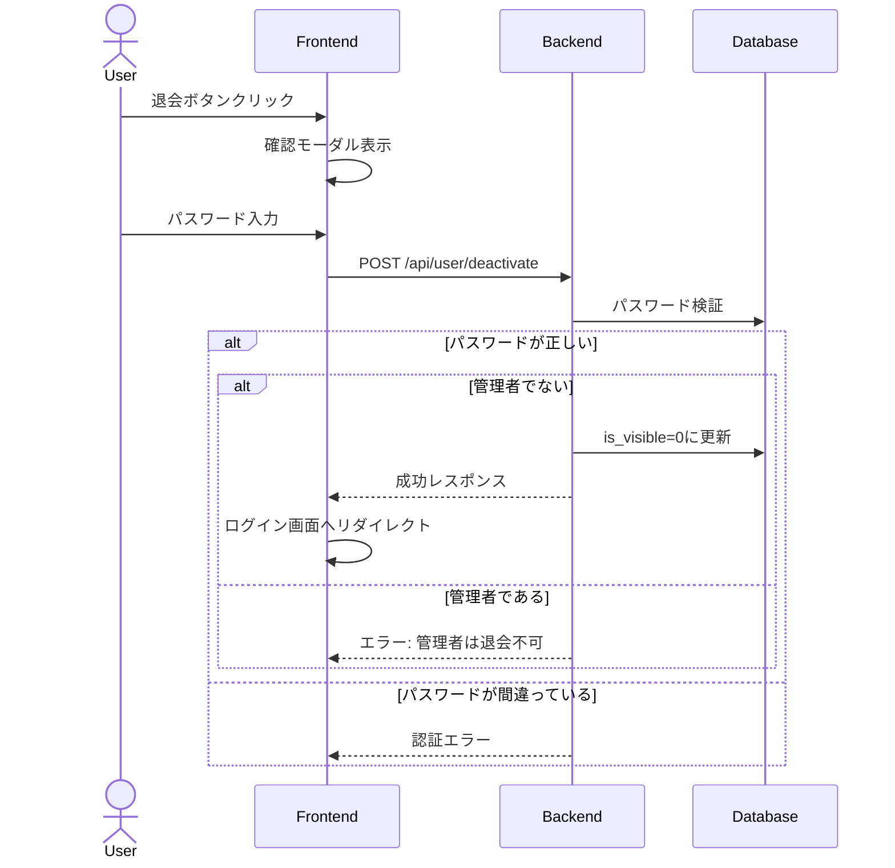
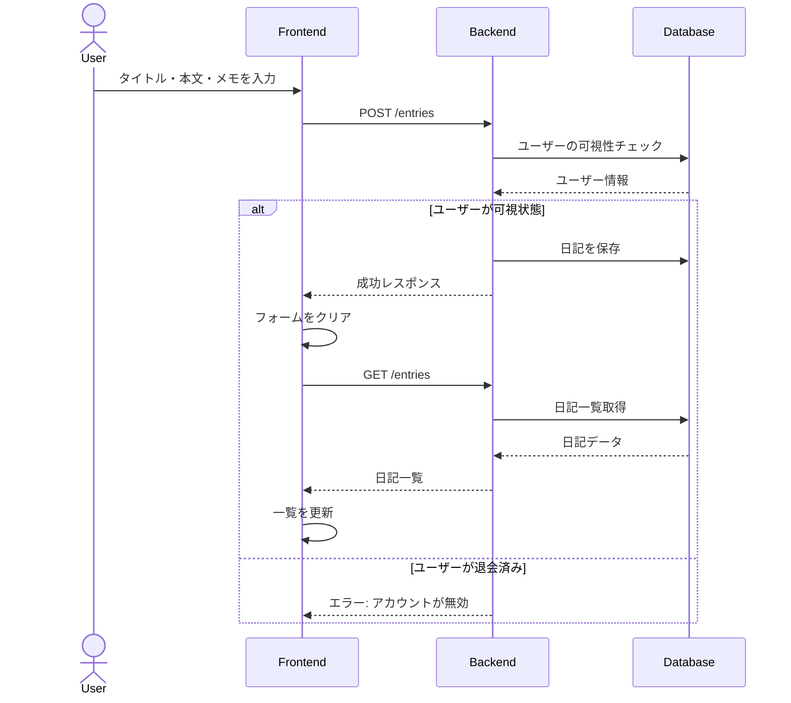
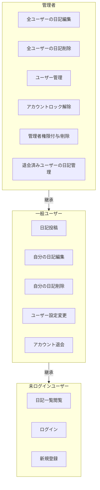
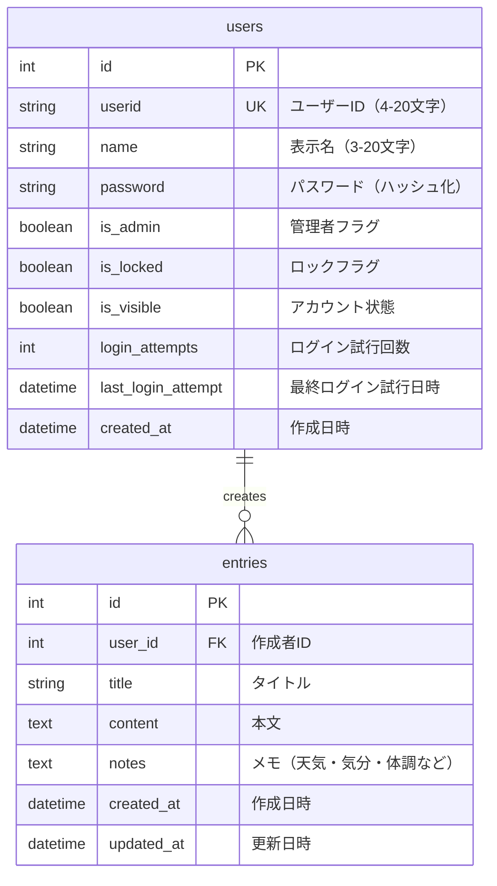
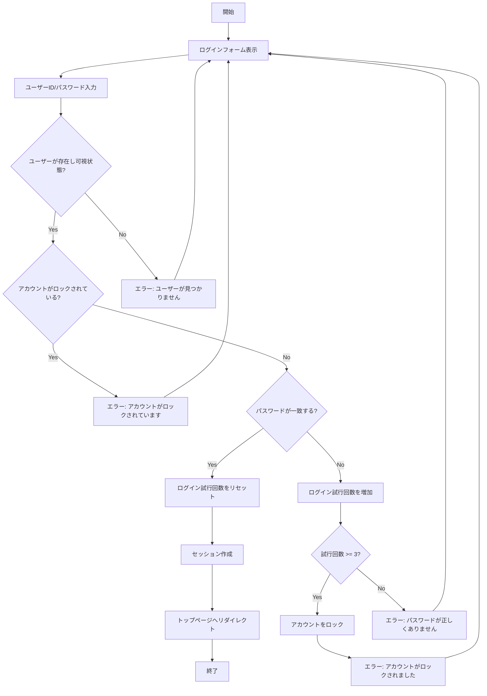
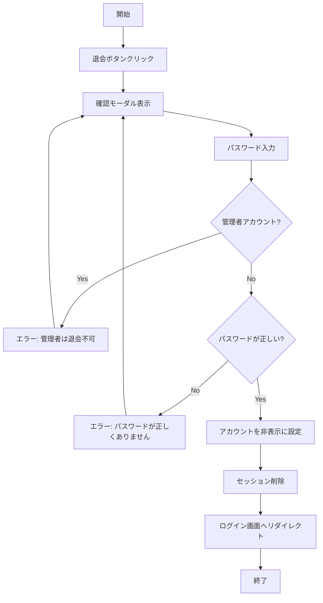
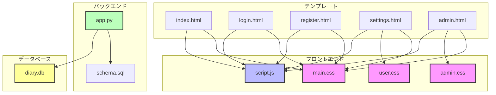

# シンプル日記アプリケーション - 設計図

## 1. 画面遷移図



## 2. クラス図



## 3. シーケンス図

### ログインプロセス



### 退会プロセス


### 日記投稿プロセス




## 4. ユースケース図



## 5. ERD（Entity Relationship Diagram）



## 6. アクティビティ図

### ログインプロセス



### 退会プロセス



## 7. コンポーネント図

### システムアーキテクチャ



### ディレクトリ構造

```
/
├── app.py              # メインアプリケーション
├── schema.sql          # データベーススキーマ
├── diary.db           # SQLiteデータベース
├── requirements.txt    # 依存パッケージリスト
├── static/            # 静的ファイル
│   ├── main.css       # 共通スタイル
│   ├── admin.css      # 管理画面スタイル
│   ├── user.css       # ユーザー設定スタイル
│   └── script.js      # クライアントサイドスクリプト
└── templates/         # HTMLテンプレート
    ├── index.html     # トップページ
    ├── login.html     # ログインページ
    ├── register.html  # ユーザー登録ページ
    ├── settings.html  # ユーザー設定ページ
    └── admin.html     # 管理者ページ
```


## 8. 補足：データベース制約

### usersテーブル
- `id`: 自動増分の主キー
- `userid`: 一意制約、半角英数字のみ（4-20文字）
- `name`: 文字種自由（3-20文字）
- `password`: 8-20文字（大文字・小文字・数字を含む）
- `is_admin`: デフォルトfalse
- `is_locked`: デフォルトfalse
- `is_visible`: デフォルトtrue（退会するとfalse）
- `login_attempts`: デフォルト0
- `created_at`: NOT NULL

### entriesテーブル
- `id`: 自動増分の主キー
- `user_id`: 外部キー（users.id）、NOT NULL
- `title`: NOT NULL
- `content`: NOT NULL
- `notes`: NOT NULL、デフォルト空文字列
- `created_at`: NOT NULL
- `updated_at`: NULL許容（更新時のみ設定）
