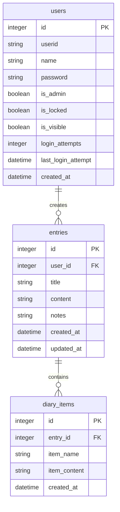
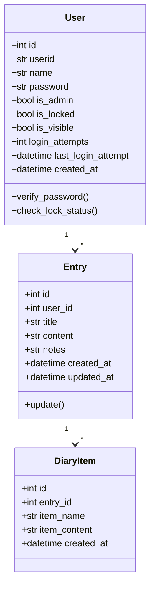

# System Diagrams

## Database ER Diagram

## Class Diagram

## Version History
- 2024/12/01: Initial release 0.01
- 2024/12/08: Model structure improvements and test additions
- 2024/12/09: Migration functionality added
- 2024/12/10: Development environment changed to conda-based
