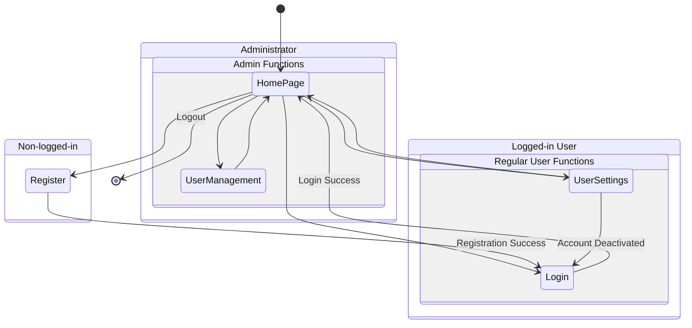
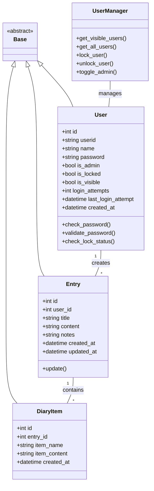
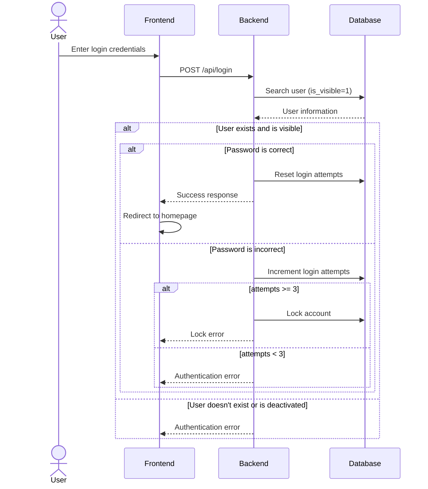
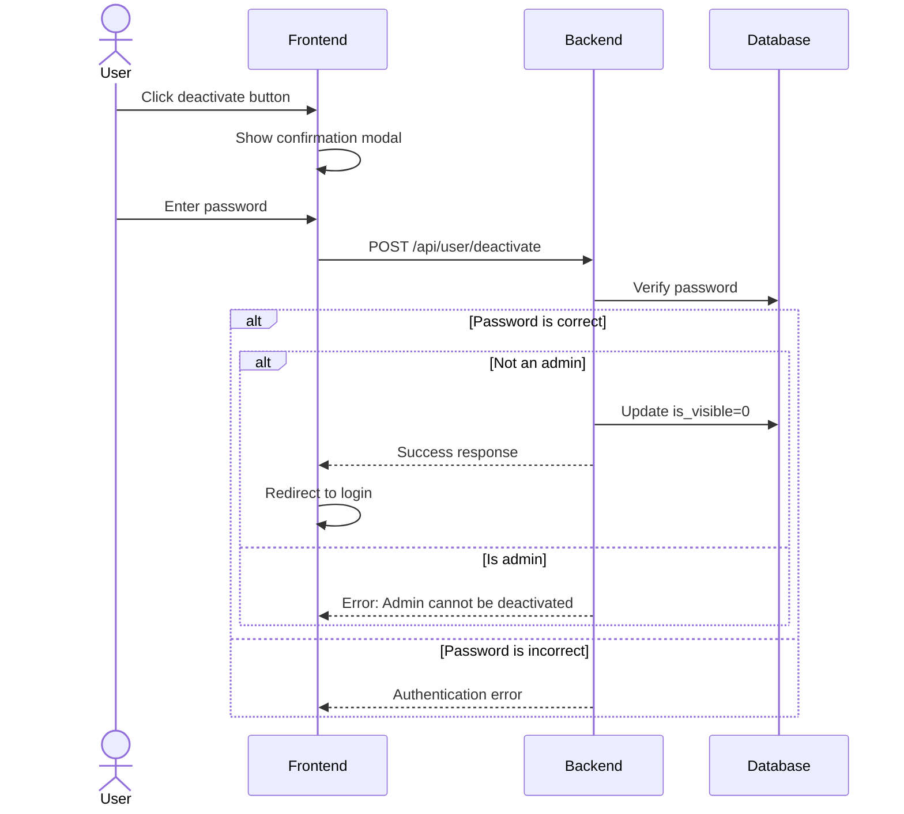
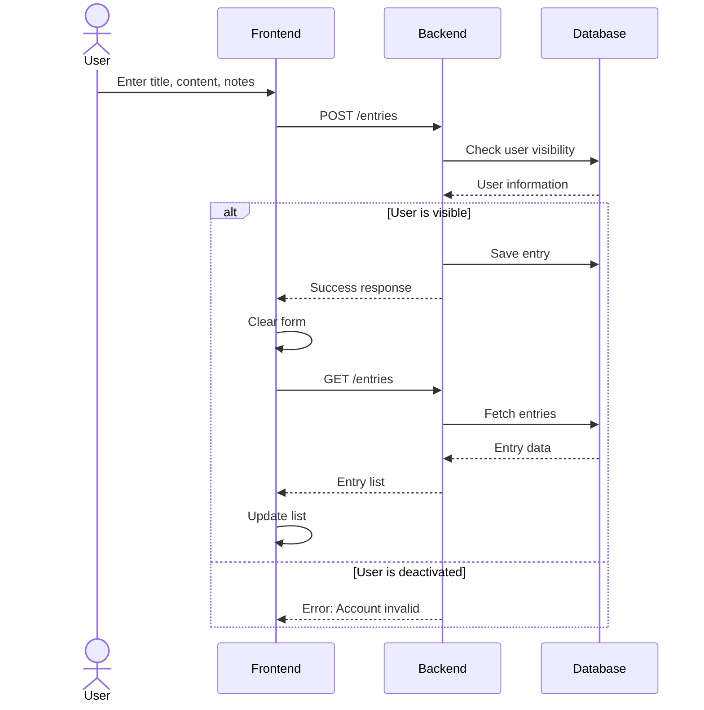
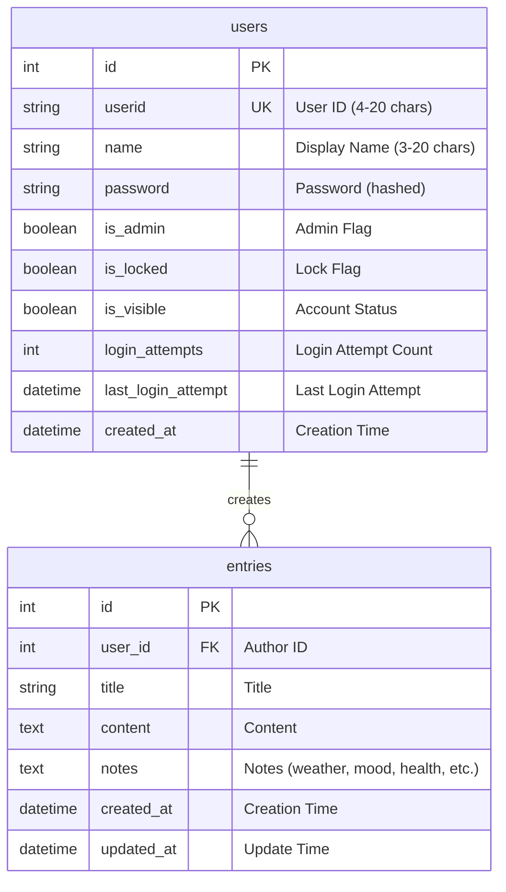
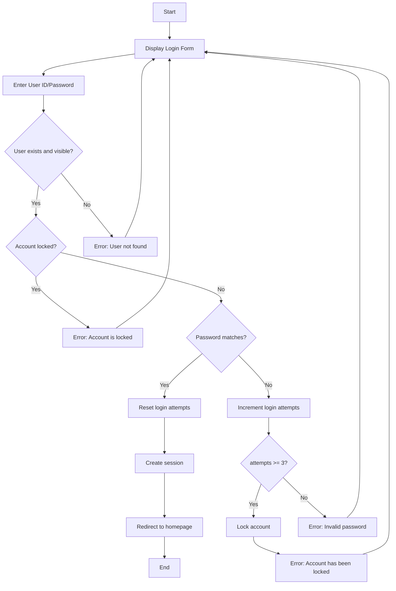
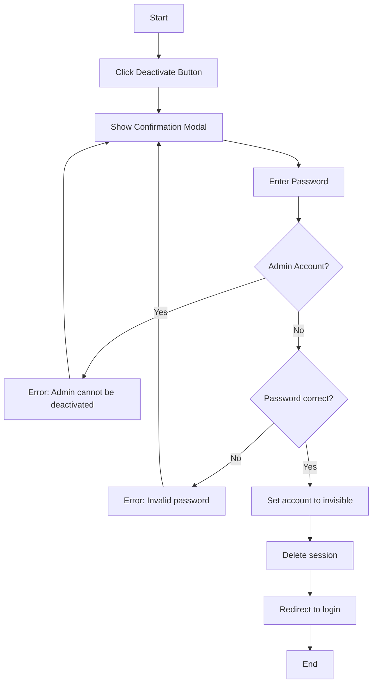
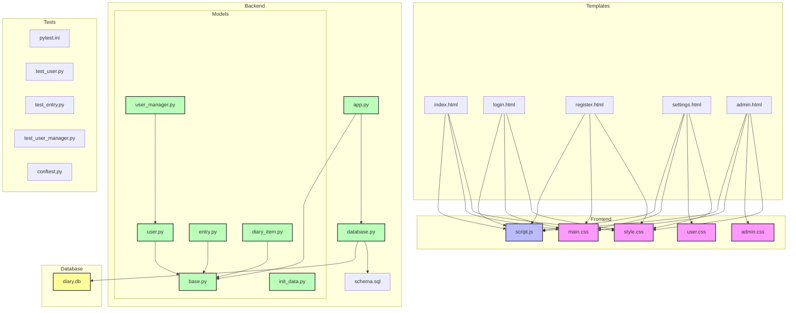

# LifeLog - Design Diagrams

## Version History
- 2024/12/01: Initial release 0.01
- 2024/12/08: Model structure improvements and test configuration additions

## 1. Screen Transition Diagram



## 5. Class Diagram



## 6. Component Diagram

### Login Process



### Account Deactivation Process



### Diary Entry Process



## 4. Use Case Diagram

```mermaid
graph TB
    subgraph Non-logged-in User
        A[View Diary List]
        B[Login]
        C[Register]
    end

    subgraph Regular User
        D[Create Entry]
        E[Edit Own Entries]
        F[Delete Own Entries]
        G[Change Settings]
        M[Deactivate Account]
    end

    subgraph Administrator
        H[Edit All Entries]
        I[Delete All Entries]
        J[User Management]
        K[Unlock Accounts]
        L[Grant/Revoke Admin]
        N[Manage Deactivated Users' Entries]
    end

    Regular User -->|inherits| Non-logged-in User
    Administrator -->|inherits| Regular User
```

## 5. ERD (Entity Relationship Diagram)



## 6. Activity Diagrams

### Login Process



### Account Deactivation Process



## 7. Component Diagram

### System Architecture



### Directory Structure

```
/
├── app.py              # Main Application
├── database.py         # Database Operations
├── models/            # Model Definitions
│   ├── __init__.py    # Model Package Initialization
│   ├── base.py        # Base Class Definition
│   ├── user.py        # User Model
│   ├── entry.py       # Diary Entry Model
│   ├── diary_item.py  # Diary Item Model
│   ├── user_manager.py # User Management
│   └── init_data.py   # Initial Data Creation
├── static/            # Static Files
│   ├── style.css      # Common Styles
│   ├── admin.css      # Admin Panel Styles
│   ├── user.css       # User Settings Styles
│   ├── main.css       # Main Styles
│   └── script.js      # Client-side Scripts
├── templates/         # HTML Templates
│   ├── index.html     # Homepage
│   ├── login.html     # Login Page
│   ├── register.html  # Registration Page
│   ├── settings.html  # User Settings Page
│   └── admin.html     # Admin Panel
├── instance/          # Instance-specific Files
│   └── diary.db      # SQLite Database
├── migrations/        # Database Migrations
├── tests/            # Test Files
│   ├── conftest.py   # Test Configuration
│   ├── test_user.py  # User Tests
│   ├── test_entry.py # Entry Tests
│   └── test_user_manager.py # User Manager Tests
└── docs/             # Documentation
    ├── specification.md     # Specifications (English)
    ├── specification_ja.md  # Specifications (Japanese)
    ├── diagrams.md         # Design Diagrams (English)
    └── diagrams_ja.md      # Design Diagrams (Japanese)
```

## 8. Additional Notes: Database Constraints

### users Table
- `id`: Auto-incrementing primary key
- `userid`: Unique constraint, alphanumeric only (4-20 characters)
- `name`: Any character type (3-20 characters)
- `password`: 8-20 characters (must include uppercase, lowercase, and numbers)
- `is_admin`: Default false
- `is_locked`: Default false
- `is_visible`: Default true (false when deactivated)
- `login_attempts`: Default 0
- `created_at`: NOT NULL

### entries Table
- `id`: Auto-incrementing primary key
- `user_id`: Foreign key (users.id), NOT NULL
- `title`: NOT NULL
- `content`: NOT NULL
- `notes`: NOT NULL, default empty string
- `created_at`: NOT NULL
- `updated_at`: NULL allowed (set only on update)
