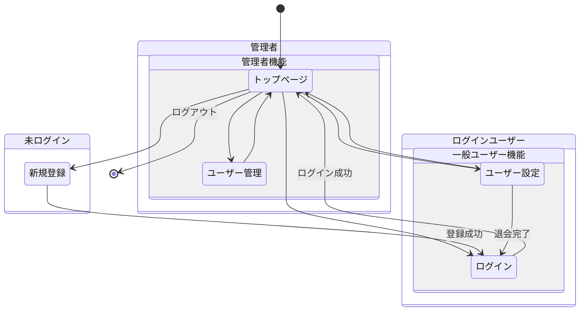
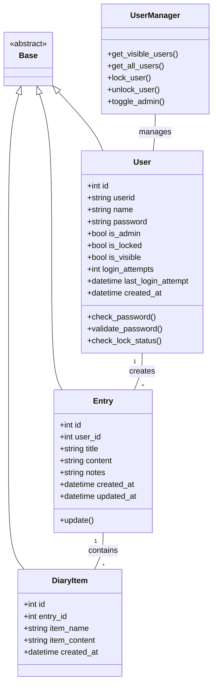
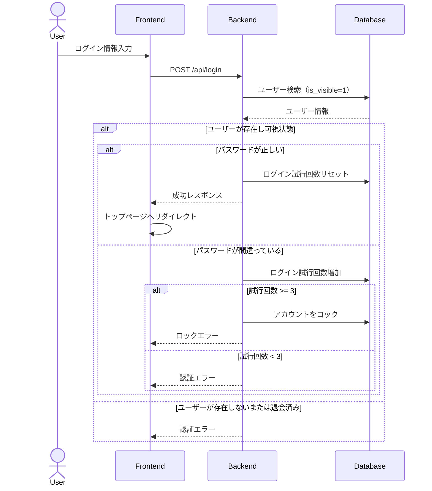
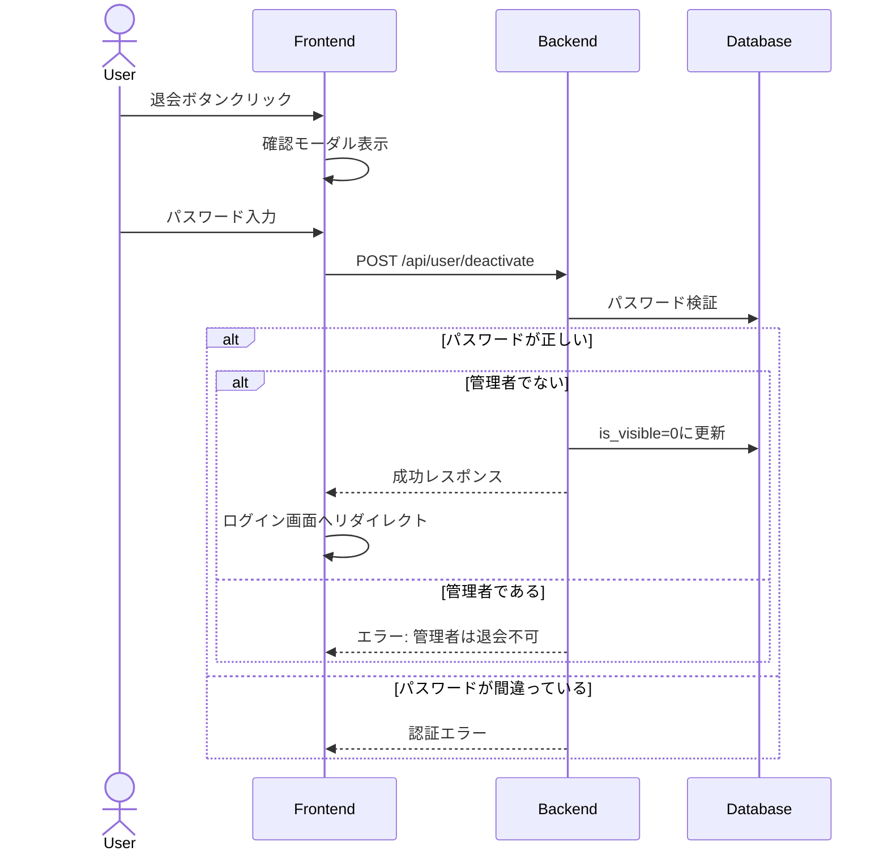
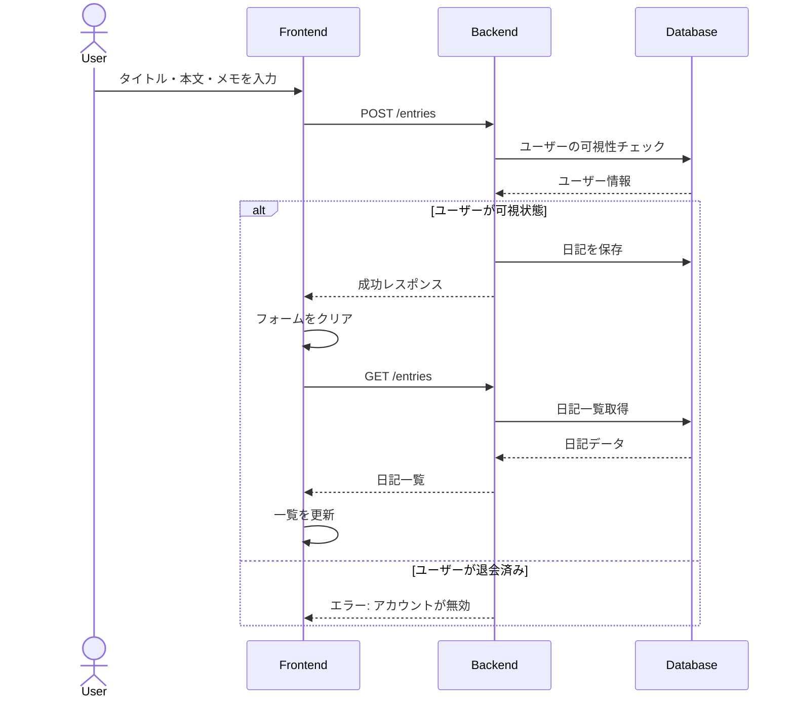
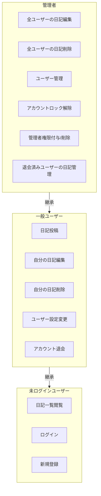
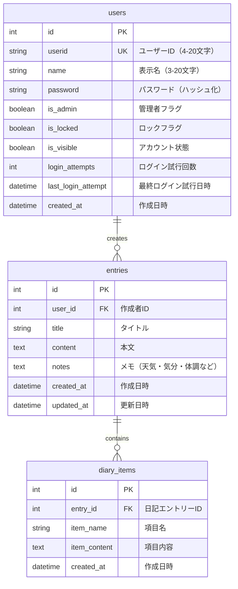
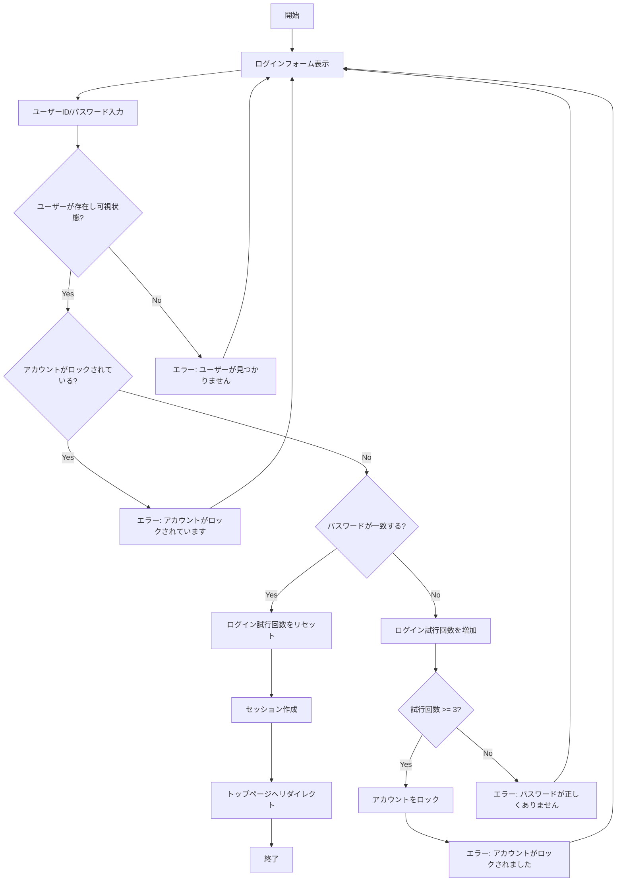
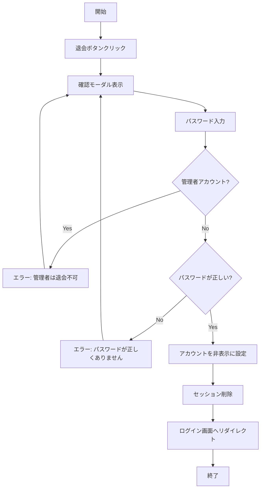
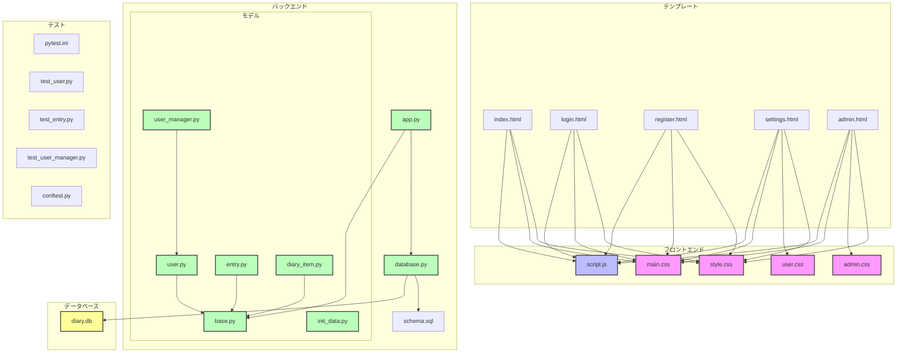

# LifeLog - 設計図

## 更新履歴
- 2024/12/01: 0.01公開
- 2024/12/08: モデル構造の改善とテスト構成の追加

## 1. 画面遷移図



## 2. クラス図



## 3. シーケンス図

### ログインプロセス



### 退会プロセス



### 日記投稿プロセス



## 4. ユースケース図




## 5. ERD（Entity Relationship Diagram）



## 6. アクティビティ図

### ログインプロセス



### 退会プロセス



## 7. コンポーネント図

### システムアーキテクチャ



### ディレクトリ構造

```
/
├── app.py              # メインアプリケーション
├── database.py         # データベース操作
├── models/            # モデル定義
│   ├── __init__.py    # モデルパッケージ初期化
│   ├── base.py        # 基本クラス定義
│   ├── user.py        # ユーザーモデル
│   ├── entry.py       # 日記エントリーモデル
│   ├── diary_item.py  # 日記項目モデル
│   ├── user_manager.py # ユーザー管理機能
│   └── init_data.py   # 初期データ作成
├── static/            # 静的ファイル
│   ├── style.css      # 共通スタイル
│   ├── admin.css      # 管理画面スタイル
│   ├── user.css       # ユーザー設定スタイル
│   ├── main.css       # メインスタイル
│   └── script.js      # クライアントサイドスクリプト
├── templates/         # HTMLテンプレート
│   ├── index.html     # トップページ
│   ├── login.html     # ログインページ
│   ├── register.html  # ユーザー登録ページ
│   ├── settings.html  # ユーザー設定ページ
│   └── admin.html     # 管理者ページ
├── instance/          # インスタンス固有のファイル
│   └── diary.db      # SQLiteデータベース
├── migrations/        # データベースマイグレーション
├── tests/            # テストファイル
│   ├── conftest.py   # テスト共通設定
│   ├── test_user.py  # ユーザーテスト
│   ├── test_entry.py # 日記エントリーテスト
│   └── test_user_manager.py # ユーザー管理テスト
└── docs/             # ドキュメント
    ├── specification.md     # 仕様書（英語）
    ├── specification_ja.md  # 仕様書（日本語）
    ├── diagrams.md         # 設計図（英語）
    └── diagrams_ja.md      # 設計図（日本語）
```

## 8. 補足：データベース制約

### usersテーブル
- `id`: 自動増分の主キー
- `userid`: 一意制約、半角英数字のみ（4-20文字）
- `name`: 文字種自由（3-20文字）
- `password`: 8-20文字（大文字・小文字・数字を含む）
- `is_admin`: デフォルトfalse
- `is_locked`: デフォルトfalse
- `is_visible`: デフォルトtrue（退会するとfalse）
- `login_attempts`: デフォルト0
- `created_at`: NOT NULL

### entriesテーブル
- `id`: 自動増分の主キー
- `user_id`: 外部キー（users.id）、NOT NULL
- `title`: NOT NULL
- `content`: NOT NULL
- `notes`: NOT NULL、デフォルト空文字列
- `created_at`: NOT NULL
- `updated_at`: NULL許容（更新時のみ設定）

